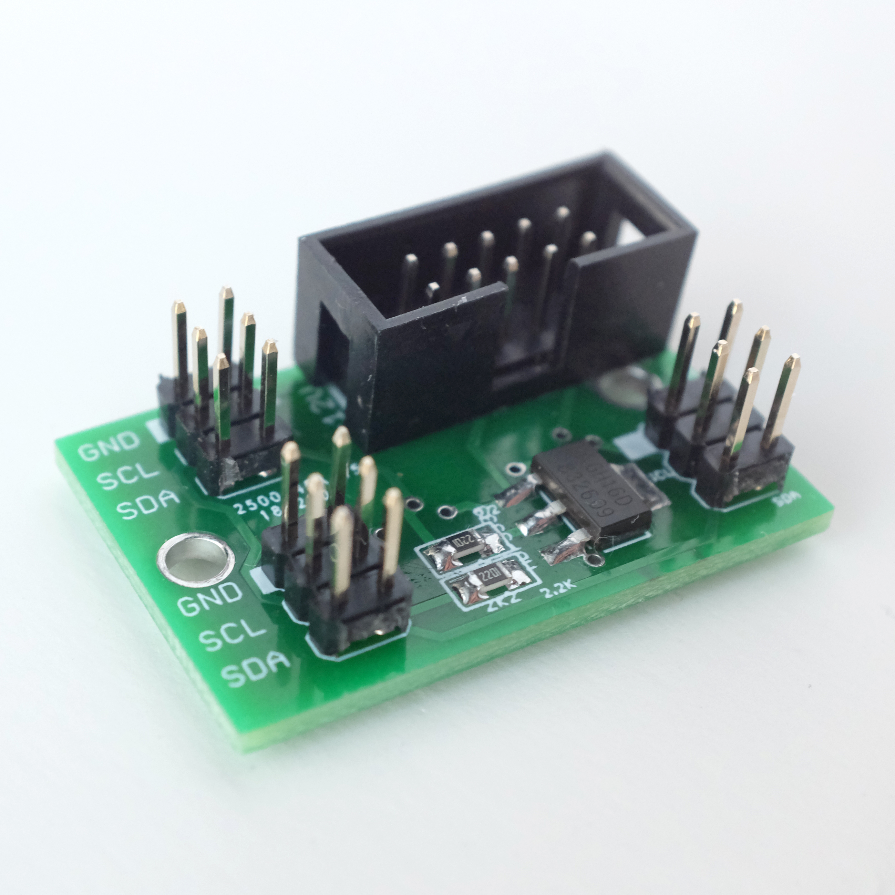
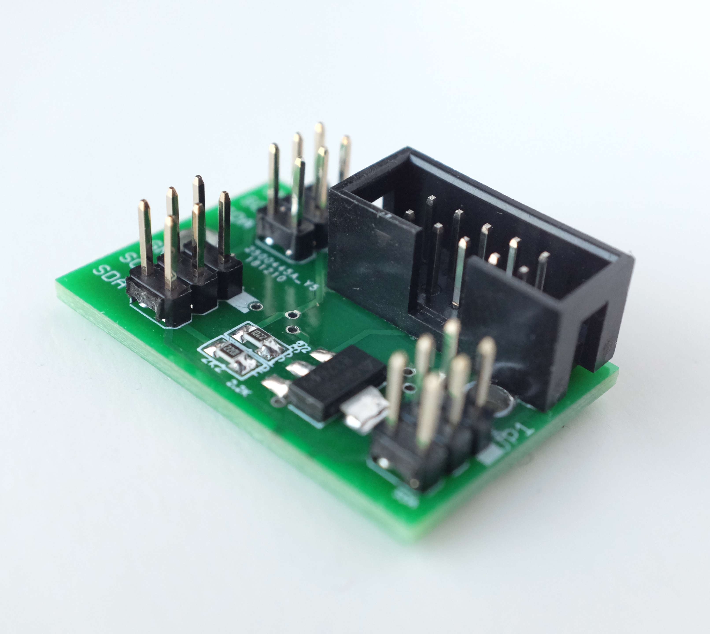
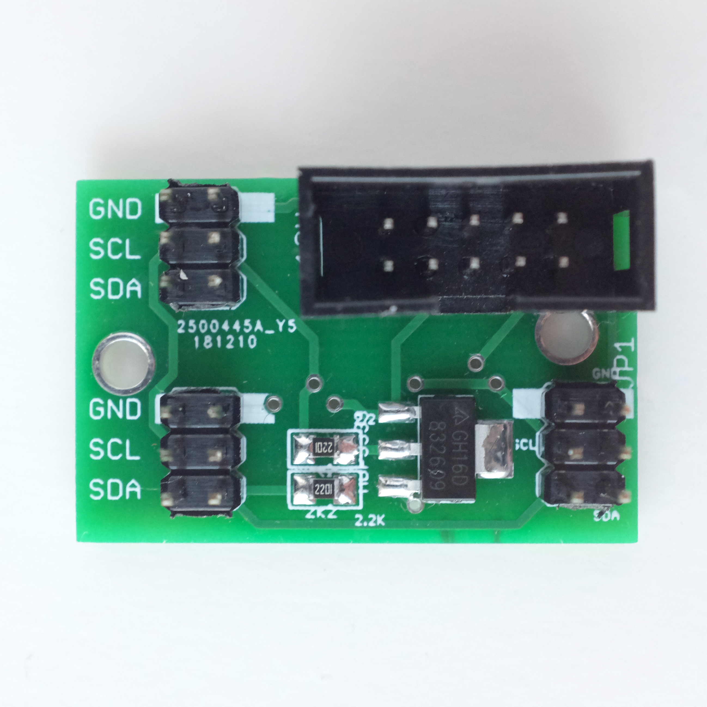

# TT-Busboard-Jr.

A small powered i2c busboard for the monome/teletype i2c ecosystem

This is compact powered i2c busboard suitable for use with Monome Teletype, Trilogy and other i2c modules. 

Provides three i2c / ii headers with pull-ups to support larger i2c / ii networks.

You can connect up to six modules with regular (1x3) i2c jumpers, or more using "flying bus" cables to connect multiple modules in series.

This busboard is designed to just hang out in the back of your rack - rather than be directly attached to a module.

## bom

* (3) header, male, 2x3 
* (1) 3v3 voltage regulator AZ1117CH-3.3TRG1DICT-ND
* (2) resistor 0805 2.2k 
* (1) header, male, shrouded, 2x5 

