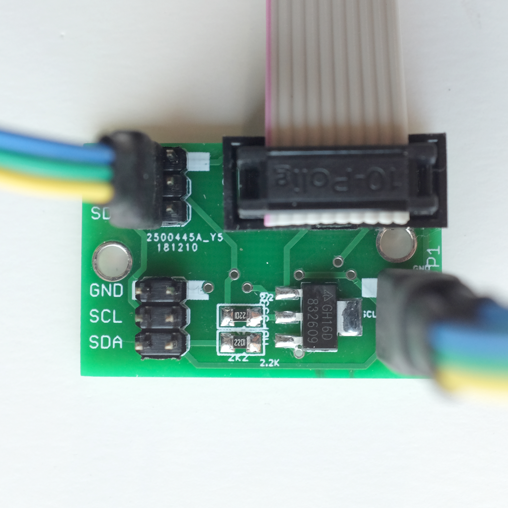

# TT-Busboard-Jr.

a small powered i2c busboard for the monome/teletype i2c ecosystem

This is compact powered i2c busboard suitable for use with Teletype, Trilogy and other i2c modules. 

It provides 3 i2c / ii headers and additional pull-up to support larger i2c / ii networks.

You can connect up to 6 modules with regular (1x3) i2c jumpers or use a "flying bus" cable to connect multiple modules in series.

This busboard is designed to just hang out in the back of your rack - rather than be directly attached to a module.

## bom

* (3) header, male, 2x3 
* (1) 3v3 voltage regulator AZ1117CH-3.3TRG1DICT-ND
* (2) resistor 0805 2.2k 
* (1) header, male, shrouded, 2x5 

